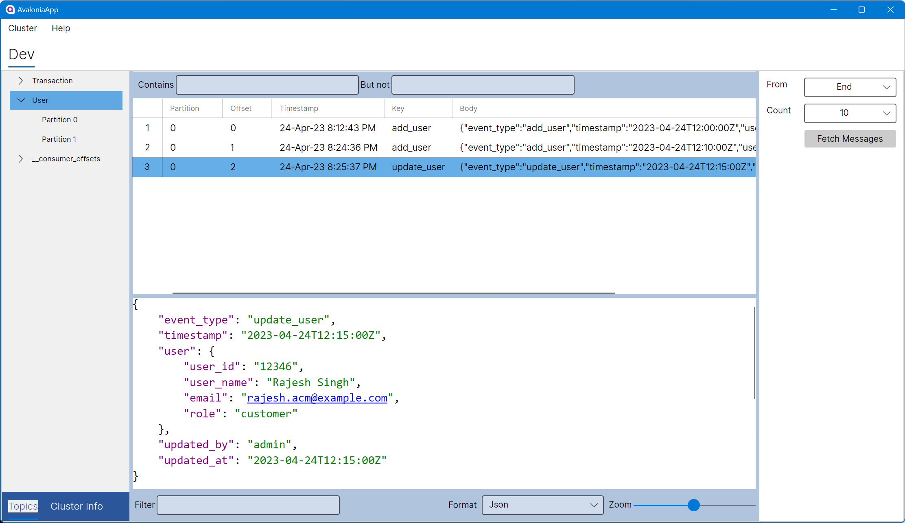

# KafkaLens

KafkaLens is an app to browse Kafka messages. It allows you to easily monitor your Kafka cluster and debug any issues.

  

    

      

    

  

## Download

Download the latest release for your operating system:

- [Windows](https://github.com/fatichar/KafkaLens/releases/latest/download/kafkalens-setup.exe)
- [macOS](https://github.com/fatichar/KafkaLens/releases/latest/download/kafkalens.dmg)
- [Linux](https://github.com/fatichar/KafkaLens/releases/latest/download/kafkalens.deb)

## Buy Me a Coffee

If you find KafkaLens useful, please consider buying me a coffee!

